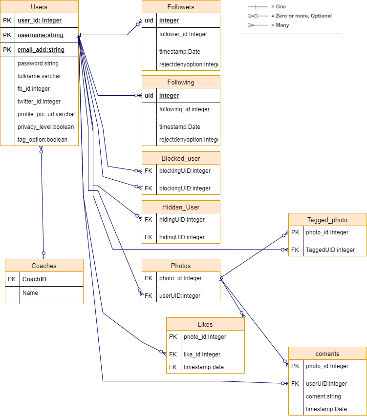

## Oplab interview

### Intro

Hi! If you wanna work with us, you gotta solve this first. Let's see what you've got!

### Instructions

1. This test should be forked, worked on, and then commited to Github, with every comment in **english**.
2. Every applicant should solve **all** the general questions.
3. An applicant must solve frontend questions if applying for a frontend position.
4. An applicant must solve backend questions if applying for a backend position.
5. Solving both, is a bonus :)
6. When you finish this test, send an e-mail containing the repository link and the salary expectations to <hungryforthisjob@oplab.com.br>
7. This test's instructions should be enough.
8. Happy Coding!

### General
Using your favorite programming language:

1. ~~Implement bubble sort.~~
 - ```Frontend/src/utils/bubbleSort.ts```
3. ~~Implement a linked list.~~

 - ```Frontend/src/utils/linkedList.js```
4. ~~Implement this [algorithm](https://www.hackerrank.com/challenges/game-of-stones-1)
~~(💡️there is no need to signup to this website. Just commit the _gameOfStones_ function implementation and that's it.💡️).~~

 - ```Frontend/src/utils/_gameOfStones_.ts```
5. ~~Using the twitter API, create a script that given a word as an input, outputs the last 10 tweets containing that word.~~<br>
 - ```Frontend/src/utils/pages/Home/index.ts```

### Frontend

_We will be evaluating everything, from reproduction accuracy, to process. If you use ( with mastery ) tools/frameworks such as `gulp`, `react`, `angular`, `webpack`, etc..; we will take that in consideration. Also: we care about beautiful code (~~var~~) 👾_

~~Reproduce, faithfully, this [page]( http://ydirection.com/Aria/index-3.html ).~~
 - ```cd Frontend```
 - ```yarn start```<br>
 **or**
 - [page-resolve]( https://andersonfrfilho.github.io/oplab-interview ).

### Backend

_I know, I know... It looks easy compared to the frontend challenge; but don't be fooled! We expect **more** from your answers in here! We will evaluate **how** you answer, and your answer's organization and structure!_

Answer the following questions:
- ~~Suppose you're working with 3 people on a project. What would be **the** ideal software development process?~~
  - ```Scrum```
- ~~How do you think an entity relationship diagram for _Instagram_ would be like?~~
  - Response

  

- ~~Now that you have imagined the ER diagram, **how** would you build _Instagram_ from scratch?~~
 - 1. analysis of infrastructure,cost requirements e design.
   - 1.1. choise language.
   - 1.6. drawer architeture structure front e back
   - 1.2. prices tools price
   - 1.3. prices infrastructure
   - 1.4. team selection
   - 1.5. prototype design development
 - 2. development of a backend (TDD).
   - 2.1. development of the data library.
   - 2.2. development of the database and relationship structure
   - 2.4. development of the communication api
 - 3. development of a frontend (TDD).
   - 3.1. development based on the design and architecture
 - 4. deployment environment development.
   - 4.1. Integration assembly continues with all services


That's it! Thanks for doing this test!
 - Thank you for the opportunity
🚀
